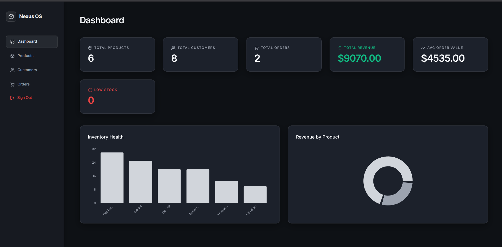
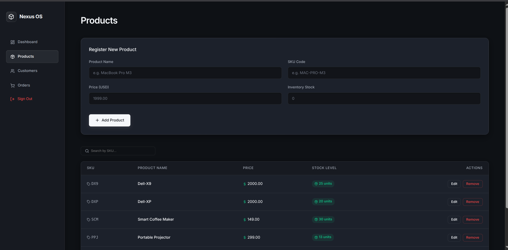
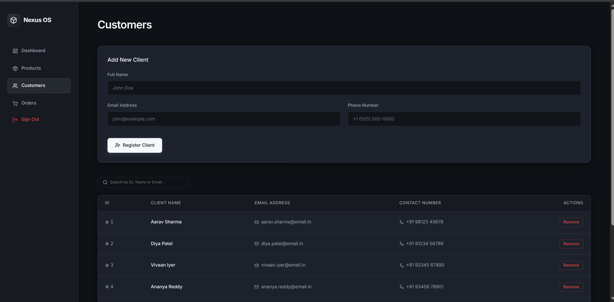
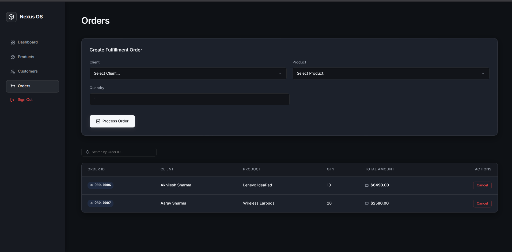
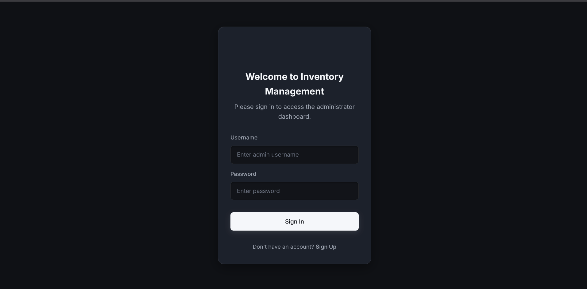

# 📦 Inventory & Order Management System

Welcome to the **Inventory & Order Management System**! This is a complete, production-ready software solution designed to help businesses effortlessly track their products, manage their customers, and fulfill their orders in real-time. 

Built with modern web technologies, this platform is incredibly fast, responsive, and easy to use on any device.

<div align="center">
  
</div>

---

## 🌟 Key Features & Interface

### 📊 Dashboard & Analytics
Get a bird's-eye view of your entire business. The dashboard automatically calculates your total revenue, counts your active orders, and alerts you when any product stock drops below 10 items.
<div align="center">
  
</div>

### 📦 Products
Manage your entire inventory catalog. Add new products, update pricing, and restock items instantly. The system prevents you from accidentally deleting a product if it is currently tied to an active customer order.
<div align="center">
  
</div>

### 👥 Customers
A built-in CRM (Customer Relationship Manager) to keep track of everyone buying your products. Store contact information and manage client details securely.
<div align="center">
  
</div>

### 🚚 Orders
Track the fulfillment pipeline from start to finish. When an order is placed, the system automatically deducts the exact quantity from your product inventory in real-time.
<div align="center">
  
</div>

---

## 🔒 Multi-Tenant Security & Authentication
This application features a **Multi-Tenant SaaS Architecture**. 
- Every user must register and log in to an account to access the system. 
- All data is heavily isolated; a user can only ever see, edit, or delete the products and orders that *they* personally created. 
- Passwords are securely hashed using `bcrypt` and sessions are managed via JWT (JSON Web Tokens).

<div align="center">
  
</div>

---

## 🛠️ Technology Stack
- **Frontend**: React, Vite, Tailwind CSS, Recharts (for analytics), Lucide React (for icons)
- **Backend**: Python, FastAPI, SQLAlchemy, PostgreSQL
- **Security**: python-jose (JWT), passlib (bcrypt)
- **Deployment**: Vercel (Frontend), Render (Backend & Database), Docker

## 🚀 Running Locally

1. Clone the repository to your machine.
2. Ensure **Docker Desktop** is running.
3. Start the entire application (Database, Backend, and Frontend) with one command:
```bash
docker-compose up --build
```
4. Open your browser and go to `http://localhost:5173`.
5. Click **Sign Up** to create your first account and start managing your inventory!
